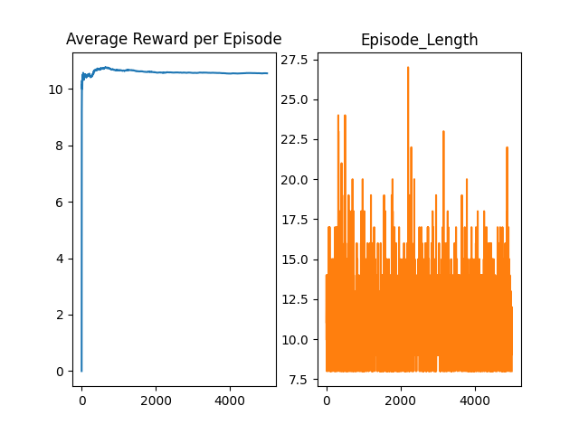
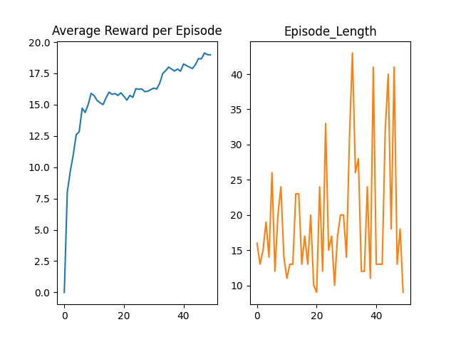

# Using-RL-in-CartPole-v1
This repository displays the use of Reinforcement Learning, specifically QLearning, REINFORCE, and Advantage Actor Critic (A2C) methods to play CartPole-v1 of OpenAI Gym. 
 
 
The Cart Lake environment can be better explained or reviwed by going to the souce code <a href="https://github.com/openai/gym/blob/master/gym/envs/classic_control/cartpole.py">here</a>.
 In this environment, there exists a pole on a frictionless wire/line, and the goal is to keep it moving without collapsing for as long as possible. The reward for standing each timestep is +1, and if the pole moves more than 15 degrees from the vertical, the episode ends (so basically no negative rewards). There are only two possible actions that are moving the point on the pole on the wire/line right or left, every timestep.
 
 
This environment has been solved with the objective of reaching maximum reward (thus reaching the final goal), and has been done so, by using three deep reinforcement learning techniques (all use a neural network function approximator having same architecture, mapping form state to action/policy), each trained on 5,000 episodes.
 
 
To better play this environment, there are three deep reinforcement learning techniques used, and compared:
 
<h3>1. Deep QLearning Method</h2>
 Using experience replay with bootstrapping every timestep.
 The average total rewards and episode lengths look like:
 

 
<h3>2. REINFORCE Method</h2>
 Uses a policy gradient technique with every visit monte carlo sampling at the end of each episode.
 The average rewards and episode lengths look like:
 

 
<h3>3. Advantage Actor-Critic (A2C) Method</h2>
  A single network architecture mapping to both value and policy, to obtain advantages to use instead of returns in a policy gradient and Qlearning update.
 The average rewards and episode lengths look like:
 

 
 
As it can be seen, though Deep QLearning and REINFORCE methods give similar results (not always but true in this case), actor critic methods can do much better, in this case, almost twice (as written in the paper on A3C by Google DeepMind)!
